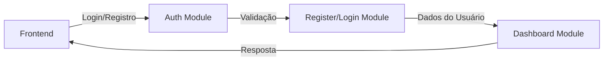
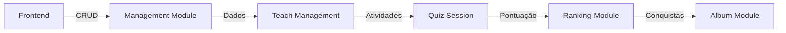

# Documentação do Backend - Sistema de Gestão Educacional

## 📋 Visão Geral
API RESTful desenvolvida em Node.js com TypeScript, Express e Prisma para gerenciamento de usuários, turmas e quizzes.

## 🔌 Endpoints da API

### Autenticação

#### Login
```http
POST /api/auth/login
Content-Type: application/json

{
  "email": "usuario@email.com",
  "password": "senha123"
}

// Resposta
{
  "token": "jwt_token",
  "user": {
    "id": "uuid",
    "name": "Nome do Usuário",
    "email": "usuario@email.com",
    "role": "student"
  }
}
```

#### Registro
```http
POST /api/auth/register
Content-Type: application/json

{
  "name": "Nome do Usuário",
  "email": "usuario@email.com",
  "password": "senha123",
  "role": "student"
}

// Resposta
{
  "id": "uuid",
  "name": "Nome do Usuário",
  "email": "usuario@email.com",
  "role": "student"
}
```

### Usuários

#### Listar Todos os Usuários
```http
GET /api/users
Authorization: Bearer {token}

// Resposta
[
  {
    "id": "uuid",
    "name": "Nome do Usuário",
    "email": "usuario@email.com",
    "role": "student",
    "class_id": "uuid_da_turma"
  }
]
```

#### Buscar Usuário por ID
```http
GET /api/users/:id
Authorization: Bearer {token}

// Resposta
{
  "id": "uuid",
  "name": "Nome do Usuário",
  "email": "usuario@email.com",
  "role": "student",
  "class_id": "uuid_da_turma"
}
```

#### Listar Usuários por Turma
```http
GET /api/users/class/:classId
Authorization: Bearer {token}

// Resposta
[
  {
    "id": "uuid",
    "name": "Nome do Usuário",
    "email": "usuario@email.com",
    "role": "student"
  }
]
```

#### Criar Usuário
```http
POST /api/users
Authorization: Bearer {token}
Content-Type: application/json

{
  "name": "Nome do Usuário",
  "email": "usuario@email.com",
  "password": "senha123",
  "role": "student",
  "class_id": "uuid_da_turma"
}

// Resposta
{
  "id": "uuid",
  "name": "Nome do Usuário",
  "email": "usuario@email.com",
  "role": "student",
  "class_id": "uuid_da_turma"
}
```

#### Atualizar Usuário
```http
PUT /api/users/:id
Authorization: Bearer {token}
Content-Type: application/json

{
  "name": "Novo Nome",
  "email": "novo@email.com",
  "class_id": "uuid_da_turma"
}

// Resposta
{
  "id": "uuid",
  "name": "Novo Nome",
  "email": "novo@email.com",
  "role": "student",
  "class_id": "uuid_da_turma"
}
```

#### Deletar Usuário
```http
DELETE /api/users/:id
Authorization: Bearer {token}

// Resposta
{
  "message": "Usuário deletado com sucesso"
}
```

### Turmas

#### Listar Todas as Turmas
```http
GET /api/classes
Authorization: Bearer {token}

// Resposta
[
  {
    "id": "uuid",
    "name": "Nome da Turma",
    "professor_id": "uuid_do_professor",
    "codigo": "CODIGO123"
  }
]
```

#### Buscar Turma por ID
```http
GET /api/classes/:id
Authorization: Bearer {token}

// Resposta
{
  "id": "uuid",
  "name": "Nome da Turma",
  "professor_id": "uuid_do_professor",
  "codigo": "CODIGO123"
}
```

#### Criar Turma
```http
POST /api/classes
Authorization: Bearer {token}
Content-Type: application/json

{
  "name": "Nome da Turma",
  "professor_id": "uuid_do_professor",
  "codigo": "CODIGO123"
}

// Resposta
{
  "id": "uuid",
  "name": "Nome da Turma",
  "professor_id": "uuid_do_professor",
  "codigo": "CODIGO123"
}
```

#### Atualizar Turma
```http
PUT /api/classes/:id
Authorization: Bearer {token}
Content-Type: application/json

{
  "name": "Novo Nome da Turma",
  "professor_id": "uuid_do_professor"
}

// Resposta
{
  "id": "uuid",
  "name": "Novo Nome da Turma",
  "professor_id": "uuid_do_professor",
  "codigo": "CODIGO123"
}
```

#### Deletar Turma
```http
DELETE /api/classes/:id
Authorization: Bearer {token}

// Resposta
{
  "message": "Turma deletada com sucesso"
}
```

### Quizzes

#### Listar Todos os Quizzes
```http
GET /api/quizzes
Authorization: Bearer {token}

// Resposta
[
  {
    "id": "uuid",
    "title": "Título do Quiz",
    "description": "Descrição do Quiz",
    "criado_por": "uuid_do_professor",
    "pontos": 10,
    "tipo": "multiple_choice",
    "class_id": "uuid_da_turma"
  }
]
```

#### Buscar Quiz por ID
```http
GET /api/quizzes/:id
Authorization: Bearer {token}

// Resposta
{
  "id": "uuid",
  "title": "Título do Quiz",
  "description": "Descrição do Quiz",
  "criado_por": "uuid_do_professor",
  "pontos": 10,
  "tipo": "multiple_choice",
  "class_id": "uuid_da_turma"
}
```

#### Criar Quiz
```http
POST /api/quizzes
Authorization: Bearer {token}
Content-Type: application/json

{
  "title": "Título do Quiz",
  "description": "Descrição do Quiz",
  "criado_por": "uuid_do_professor",
  "pontos": 10,
  "tipo": "multiple_choice",
  "class_id": "uuid_da_turma"
}

// Resposta
{
  "id": "uuid",
  "title": "Título do Quiz",
  "description": "Descrição do Quiz",
  "criado_por": "uuid_do_professor",
  "pontos": 10,
  "tipo": "multiple_choice",
  "class_id": "uuid_da_turma"
}
```

#### Deletar Quiz
```http
DELETE /api/quizzes/:id
Authorization: Bearer {token}

// Resposta
{
  "message": "Quiz deletado com sucesso"
}
```

#### Listar Quizzes do Professor
```http
GET /api/teacher/quizzes
Authorization: Bearer {token}

// Resposta
[
  {
    "id": "uuid",
    "title": "Título do Quiz",
    "description": "Descrição do Quiz",
    "criado_por": "uuid_do_professor",
    "pontos": 10,
    "tipo": "multiple_choice",
    "class_id": "uuid_da_turma"
  }
]
```

#### Listar Quizzes por Turma
```http
GET /api/teacher/class/:classId/quizzes
Authorization: Bearer {token}

// Resposta
[
  {
    "id": "uuid",
    "title": "Título do Quiz",
    "description": "Descrição do Quiz",
    "criado_por": "uuid_do_professor",
    "pontos": 10,
    "tipo": "multiple_choice",
    "class_id": "uuid_da_turma"
  }
]
```

## 🔒 Autenticação

### Token JWT
- Todas as rotas (exceto login e registro) requerem autenticação
- O token deve ser enviado no header `Authorization` como `Bearer {token}`
- O token expira em 24 horas

### Exemplo de Uso no Frontend
```typescript
// Configuração do Axios
import axios from 'axios';

const api = axios.create({
  baseURL: 'http://localhost:3000/api',
});

// Interceptor para adicionar token
api.interceptors.request.use((config) => {
  const token = localStorage.getItem('token');
  if (token) {
    config.headers.Authorization = `Bearer ${token}`;
  }
  return config;
});

// Exemplo de login
const login = async (email: string, password: string) => {
  try {
    const response = await api.post('/auth/login', { email, password });
    const { token, user } = response.data;
    localStorage.setItem('token', token);
    return user;
  } catch (error) {
    throw error;
  }
};
```

## ⚠️ Tratamento de Erros

### Códigos de Status
- 200: Sucesso
- 201: Criado com sucesso
- 400: Erro de validação
- 401: Não autorizado
- 403: Proibido
- 404: Não encontrado
- 500: Erro interno do servidor

### Formato de Erro
```json
{
  "error": "Mensagem de erro",
  "details": {
    "campo": ["erro específico"]
  }
}
```

## 🔄 Fluxo de Dados

### Criação de Turma e Usuários
1. Criar professor (POST /api/users)
2. Criar turma (POST /api/classes)
3. Criar alunos (POST /api/users)

### Criação de Quiz
1. Professor faz login
2. Cria quiz (POST /api/quizzes)
3. Quiz é associado à turma

## 🎯 Boas Práticas para o Frontend

1. **Gerenciamento de Estado**
   - Use Context API para autenticação
   - Use estado local para formulários
   - Cache de dados quando apropriado

2. **Tratamento de Erros**
   - Trate todos os erros da API
   - Mostre mensagens amigáveis
   - Implemente retry para falhas de rede

3. **Performance**
   - Implemente paginação
   - Use cache de dados
   - Otimize requisições

4. **UX**
   - Feedback imediato para ações
   - Loading states
   - Validação em tempo real

# Documentação dos Módulos do Sistema

## 📦 Estrutura de Módulos

### 1. Módulo de Autenticação (`auth/`)
- **Responsabilidade**: Gerenciar autenticação e autorização
- **Funcionalidades**:
  - Login de usuários
  - Registro de novos usuários
  - Geração e validação de tokens JWT
  - Middleware de autenticação
- **Arquivos Principais**:
  - `auth_controller.ts`: Controla fluxo de autenticação
  - `auth_middleware.ts`: Verifica tokens JWT
  - `auth_use_case.ts`: Lógica de negócio

### 2. Módulo de Registro (`register/`)
- **Responsabilidade**: Gerenciar registro de novos usuários
- **Funcionalidades**:
  - Validação de dados de registro
  - Criação de novos usuários
  - Verificação de email único
  - Hash de senhas
- **Arquivos Principais**:
  - `register_controller.ts`: Controla fluxo de registro
  - `register_use_case.ts`: Lógica de negócio
  - `register_repository.ts`: Persistência de dados

### 3. Módulo de Login (`login/`)
- **Responsabilidade**: Gerenciar autenticação de usuários
- **Funcionalidades**:
  - Validação de credenciais
  - Geração de tokens JWT
  - Verificação de senha
  - Retorno de dados do usuário
- **Arquivos Principais**:
  - `login_controller.ts`: Controla fluxo de login
  - `login_use_case.ts`: Lógica de negócio
  - `login_repository.ts`: Acesso a dados

### 4. Módulo de Gestão (`management/`)
- **Responsabilidade**: Gerenciar usuários e turmas
- **Funcionalidades**:
  - CRUD de usuários
  - CRUD de turmas
  - Associação de usuários a turmas
  - Gerenciamento de professores e alunos
- **Submódulos**:
  - **Usuários**:
    - Listagem de usuários
    - Busca por ID
    - Busca por turma
    - Criação/atualização/deleção
  - **Turmas**:
    - Listagem de turmas
    - Busca por ID
    - Criação/atualização/deleção
    - Geração de códigos únicos

### 5. Módulo de Gestão de Ensino (`teachmanagement/`)
- **Responsabilidade**: Gerenciar conteúdo educacional
- **Funcionalidades**:
  - Criação de atividades
  - Gerenciamento de semanas
  - Organização de conteúdo
  - Acompanhamento de progresso
- **Submódulos**:
  - **Atividades**:
    - Criação de atividades
    - Atribuição de atividades
    - Correção de atividades
  - **Semanas**:
    - Organização por semanas
    - Conteúdo semanal
    - Progresso do aluno

### 6. Módulo de Sessão de Quiz (`quizsession/`)
- **Responsabilidade**: Gerenciar sessões de quiz
- **Funcionalidades**:
  - Início de sessão de quiz
  - Submissão de respostas
  - Navegação entre questões
  - Controle de tempo
- **Arquivos Principais**:
  - `quiz_session_controller.ts`: Controla fluxo da sessão
  - `quiz_session_use_case.ts`: Lógica de negócio
  - `quiz_session_repository.ts`: Persistência de dados

### 7. Módulo de Álbum (`album/`)
- **Responsabilidade**: Gerenciar álbum de conquistas
- **Funcionalidades**:
  - Registro de conquistas
  - Visualização de progresso
  - Sistema de recompensas
  - Histórico de atividades
- **Arquivos Principais**:
  - `album_controller.ts`: Controla fluxo do álbum
  - `album_use_case.ts`: Lógica de negócio
  - `album_repository.ts`: Persistência de dados

### 8. Módulo de Ranking (`ranking/`)
- **Responsabilidade**: Gerenciar sistema de ranking
- **Funcionalidades**:
  - Pontuação de usuários
  - Classificação geral
  - Ranking por turma
  - Histórico de pontuação
- **Arquivos Principais**:
  - `ranking_controller.ts`: Controla fluxo do ranking
  - `ranking_use_case.ts`: Lógica de negócio
  - `ranking_repository.ts`: Persistência de dados

## 🔄 Fluxo de Dados entre Módulos

### Fluxo de Autenticação


### Fluxo de Gestão


## 📊 Modelos de Dados

### Usuário
```typescript
interface User {
  id: string;
  name: string;
  email: string;
  password: string;
  role: 'student' | 'teacher';
  class_id?: string;
  points?: number;
  created_at: Date;
  updated_at: Date;
}
```

### Turma
```typescript
interface Class {
  id: string;
  name: string;
  professor_id: string;
  codigo: string;
  created_at: Date;
  updated_at: Date;
}
```

### Quiz
```typescript
interface Quiz {
  id: string;
  title: string;
  description: string;
  criado_por: string;
  pontos: number;
  tipo: 'multiple_choice' | 'true_false' | 'open_ended';
  class_id: string;
  created_at: Date;
  updated_at: Date;
}
```

### Sessão de Quiz
```typescript
interface QuizSession {
  id: string;
  user_id: string;
  quiz_id: string;
  status: 'active' | 'completed' | 'expired';
  current_question: number;
  score: number;
  started_at: Date;
  completed_at?: Date;
}
```

### Conquista
```typescript
interface Achievement {
  id: string;
  user_id: string;
  type: string;
  description: string;
  points: number;
  unlocked_at: Date;
}
```

### Ranking
```typescript
interface Ranking {
  user_id: string;
  class_id: string;
  total_points: number;
  position: number;
  last_updated: Date;
}
```

## 🔒 Segurança e Validação

### Autenticação
- Tokens JWT para todas as rotas protegidas
- Expiração de tokens em 24 horas
- Refresh token para renovação

### Autorização
- Verificação de papéis (professor/aluno)
- Validação de permissões por módulo
- Controle de acesso baseado em funções

### Validação de Dados
- Validação de entrada em todas as rotas
- Sanitização de dados
- Prevenção de SQL Injection


## 📚 Recursos Adicionais

- [Documentação do Express](https://expressjs.com/)
- [Documentação do Prisma](https://www.prisma.io/docs/)
- [Documentação do JWT](https://jwt.io/introduction)
- [Documentação do TypeScript](https://www.typescriptlang.org/docs/) 